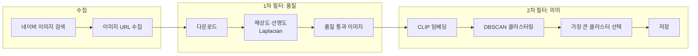

# CV-Dataset-Builder

검색어 하나로 **고품질 이미지 데이터셋**을 자동으로 만드는 도구입니다.  
네이버 이미지 검색 → 품질/의미 필터 → **CLIP + DBSCAN 클러스터링**으로 “진짜 원하는 사진만" 저장합니다.

### 이 구조가 필요한 이유

검색 결과에는 **원하는 대상과 비슷해 보이지만 다른 것**(예: 다른 캐릭터, 관련 없는 스크린샷)이 많이 섞입니다.  
그래서 “URL 많이 모으기”만 하면 데이터셋 품질이 떨어지므로, **세 단계**로 거릅니다.

1. **네이버 이미지 검색**  
   검색어로 나온 이미지 URL을 가능한 한 많이 수집합니다. 이 단계만 있으면 노이즈가 많습니다.

2. **품질·의미 필터**  
   - **품질**: 해상도·선명도(Laplacian)로 흐리거나 너무 작은 이미지를 제거합니다.  
   - **의미**: CLIP으로 각 이미지를 “의미 벡터”로 바꿉니다. 비슷한 내용이면 벡터가 가깝게 나옵니다.

3. **CLIP + DBSCAN 클러스터링**  
   - CLIP 벡터끼리 **DBSCAN**(거리 기준: 코사인, eps=0.18)으로 그룹(클러스터)을 만듭니다.  
   - 한 클러스터 = “비주얼이 비슷한 이미지들”.  
   - **가장 크게 모인 클러스터**를 “진짜 검색어에 해당하는 그룹”으로 보고, **그 클러스터만** 저장합니다.  
   - 나머지(노이즈·다른 주제)는 저장하지 않습니다.

정리하면, **수집 → 품질 걸러내기 → 의미(CLIP)로 벡터화 → DBSCAN으로 한 덩어리만 골라 저장**하는 구조입니다.



---

## 목적

교육용·학습용 이미지 세트를 만들 때, 단순 크롤링만 하면 **노이즈가 많고**, 비슷해 보이지만 다른 캐릭터/객체가 섞여 **그대로 쓰기엔 품질이 떨어집니다.**  
이 프로젝트는 **수집 → 품질 필터 → 의미 기반 클러스터링**까지 한 번에 처리해서, “검색어와 리터럴리 같은"
사진만 골라 데이터셋으로 저장하는 것을 목표로 합니다.

---

## 사용 기법

| 구분 | 기술 | 역할 |
|------|------|------|
| **수집** | Selenium + Chrome Headless | 네이버 이미지 검색 페이지에서 URL 수집, 스크롤로 lazy-load 이미지 확보 |
| **품질 필터** | OpenCV, Laplacian(blur) | 최소 해상도(300px), 선명도 기준으로 흐린/작은 이미지 제거 |
| **의미 벡터** | **CLIP** (OpenAI ViT-B/32) | 이미지 → 고차원 임베딩. “의미적으로 비슷한” 이미지가 비슷한 벡터로 나옴 |
| **클러스터링** | **DBSCAN** (cosine, eps=0.18) | 임베딩끼리 코사인 유사도로 그룹 형성. 노이즈(-1) 제외 후 **가장 큰 클러스터** = “진짜 검색어” 그룹으로 선택 |
| **저장** | 파일 시스템 + manifest.jsonl | 선택된 클러스터만 `img_0001.jpg` 형식으로 저장, 메타데이터는 JSONL에 기록 |

정리하면, **CLIP으로 이미지 의미를 벡터화하고, DBSCAN으로 “가장 많이 모인 비주얼 패턴” 하나를 골라** 그 그룹만 남깁니다. 검색 결과에 섞인 다른 캐릭터/무관 이미지는 자연스럽게 걸러집니다.

### 이 프로젝트에서 사용되는 AI 모델

**“의미로 비슷한 걸 묶는” 2차 필터만 AI(신경망)를 씁니다.** 수집·품질 필터·클러스터링은 비AI 방식입니다.

| 구분 | AI/신경망 여부 | 설명 |
|------|----------------|------|
| **CLIP** (2차 필터) | ✅ **딥러닝(NN)** | OpenAI의 **신경망 모델**(Vision Transformer + 텍스트 인코더). 이미지 → 의미 벡터로 바꾸는 부분. |
| 네이버 수집 | ❌ | Selenium으로 URL만 가져오는 일반 자동화. |
| 품질 필터 (해상도·Laplacian) | ❌ | 픽셀/해상도·수식 기반 알고리즘. (ML 아님) |
| **DBSCAN** 클러스터링 | ⚪ **고전 ML** | 거리 기반 **비지도 학습** 클러스터링. 신경망은 아니지만 전통적인 머신러닝 알고리즘. |

즉, **딥러닝 모델은 CLIP 하나**이고, **고전 ML**은 DBSCAN을 쓰며, 수집·품질 필터는 비ML 방식입니다.

---

## 프로젝트 파일 구조

```
CV-Dataset-Builder/
├── dashboard/                 # 웹 대시보드 (백엔드 + 프론트)
│   ├── app.py                 # FastAPI 앱: API 라우트, 수집 작업 실행, 예외 처리
│   ├── db.py                  # PostgreSQL 접속·jobs 테이블 CRUD, .env 로드
│   ├── data/                  # (로컬) jobs.json 마이그레이션용 등
│   └── static/                # 프론트 정적 파일
│       ├── index.html         # 대시보드 메인 페이지
│       ├── log.html           # 작업별 로그 전용 페이지
│       ├── css/style.css
│       └── js/app.js          # API 호출, 이력/이미지 표시, 수집 시작/중단
├── tools/
│   ├── high_quality_image_collector.py   # 수집 파이프라인: 네이버 → 품질 필터 → CLIP → DBSCAN → 저장
│   └── check_naver_crawl.py              # 네이버 셀렉터·수집 테스트용
├── data/
│   └── naver_collected/
│       └── <job_id>/          # 작업별 출력 (영문 폴더명)
│           ├── img_0001.jpg, ...
│           └── manifest.jsonl
├── .env.example               # DB 연결 예시 (복사해서 .env 사용)
├── requirements.txt
└── README.md
```

- **저장 경로**: `data/naver_collected/<job_id>` (폴더·파일명은 영문만 사용)
- **출력 파일**: `img_0001.jpg` 형식 + `manifest.jsonl` (query, file, source)

---

## 데이터 Input / Output

| 단계 | Input | Output |
|------|--------|--------|
| **사용자 입력** | 검색어, 수집 개수, 저장 폴더 | — |
| **네이버 수집** | 검색어, limit | 이미지 URL 목록 |
| **다운로드·품질** | URL 목록 | 다운로드 성공 + 해상도/선명도 통과한 이미지 (PIL/cv2) |
| **CLIP** | 이미지들 | 이미지별 임베딩 벡터 (고정 차원) |
| **DBSCAN** | 임베딩 행렬 | 클러스터 라벨 (노이즈 -1 포함) |
| **저장** | 최대 클러스터에 해당하는 이미지들 | `data/naver_collected/<job_id>/img_*.jpg` + `manifest.jsonl` |

대시보드 기준으로는: **검색어/개수/폴더** → 백엔드가 수집기(subprocess) 실행 → 수집기가 **네이버 → 품질 → CLIP → DBSCAN → 저장** 후 종료 → 백엔드가 stdout에서 “총 N장 저장됨” 파싱해 이력에 반영.

---

## 백엔드 구조

- **프레임워크**: FastAPI. 진입점은 `dashboard/app.py`.
- **역할**:
  - **API 라우트**: 수집 시작(`POST /api/run`), 이력 목록/상세(`GET /api/jobs`, `GET /api/jobs/{id}`), 이미지 목록/파일 서빙(`GET /api/jobs/{id}/images`, `.../images/{filename}`), 중단(`POST /api/jobs/{id}/cancel`), 이력 삭제(`POST /api/jobs/clear`).
  - **수집 실행**: `POST /api/run` 시 메모리 `jobs`에 한 건 추가 후, `ThreadPoolExecutor`로 `tools/high_quality_image_collector.py`를 **subprocess** 실행. 인자: 검색어, `--limit`, `--out_dir`(예: `data/naver_collected/<job_id>`).
  - **상태·로그**: subprocess의 stdout/stderr를 모아 해당 job의 `log`에 저장. 완료 시 stdout에서 “총 N장 저장됨” 정규식 파싱해 `count` 설정. **메모리**에 `jobs` dict 유지(진행 중인 `process`, `cancel_requested` 등), 동시에 **PostgreSQL**에 이력·로그 영속화(`db.save_all_jobs` 등).
- **예외 처리**: 미처리 예외는 모두 JSON `{ "detail", "error" }` 로 반환해 프론트에서 파싱 오류가 나지 않도록 처리.

---

## 프론트엔드 구조

- **위치**: `dashboard/static/`. 서버는 `/` → `index.html`, `/static/*` → 해당 파일 그대로 서빙.
- **구성**:
  - **index.html**: 검색어/수집 개수/저장 폴더 입력 폼, 수집 시작 버튼, 결과 메시지 영역, **수집 이력** 테이블(상태, 이미지 보기, 로그 링크, 중단 버튼), 이력 전체 삭제 버튼.
  - **app.js**:
    - **API 호출**: `GET /api/jobs`(이력 목록), `GET /api/jobs/{id}`(상세), `GET /api/jobs/{id}/images`(이미지 파일명 목록), `POST /api/run`(수집 시작), `POST /api/jobs/{id}/cancel`, `POST /api/jobs/clear`. 응답은 텍스트로 받은 뒤 JSON 파싱, 실패 시 `error`/`detail` 메시지 표시.
    - **동작**: 페이지 로드 시 `refreshJobs()`로 이력 표시, 수집 시작 후 폴링으로 해당 job 상태 갱신, “이미지 보기” 시 해당 job 이미지 URL로 그리드 렌더링, “로그”는 `/static/log.html?job_id=...` 새 탭.
  - **log.html**: `job_id` 쿼리로 해당 job 로그 API 또는 데이터를 사용해 로그 본문 표시(구현에 따라 `GET /api/jobs/{id}` 등 활용).
- **스타일**: `css/style.css`에서 테이블·버튼·모달·상태 색 등 정의.

---

## DB 구조 및 역할

- **DB**: PostgreSQL. 연결 정보는 프로젝트 루트 `.env` (PGHOST, PGPORT, PGDATABASE, PGUSER, PGPASSWORD). `db.py`에서 `python-dotenv`로 로드.
- **테이블**: `jobs` 한 개. 컬럼: `id`, `query`, `request_limit`, `out_dir`, `status`, `count`, `error`, `log`, `started_at`, `finished_at`. 앱 기동 시 없으면 `CREATE TABLE IF NOT EXISTS` 로 생성.
- **역할**: 수집 **이력·로그** 영속화. 대시보드에서 보는 “수집 이력”은 기동 시 DB에서 읽어 메모리 `jobs`에 채우고, 수집 완료/실패/중단 시마다 `db.save_all_jobs`로 DB에 다시 씁니다. “이력 전체 삭제” 시 메모리 비우고 `db.clear_all_jobs()` 호출.
- **마이그레이션**: `dashboard/data/jobs.json`이 있으면 첫 기동 시 한 번만 DB로 이전(`db.migrate_from_json_if_needed`).

---

## 설치 및 요구사항

- Python 3.10+
- Chrome (Selenium + webdriver-manager)
- PostgreSQL (이력·로그 저장)
- CUDA 선택: 있으면 CLIP GPU, 없으면 CPU

```bash
pip install -r requirements.txt
```

주요 의존성: `selenium`, `webdriver-manager`, `transformers`, `torch`, `scikit-learn`, `opencv-python`, `Pillow`, `fastapi`, `uvicorn`, `psycopg2-binary`, `python-dotenv`.

---

## 사용법

### 1. 환경 설정

- `.env.example`을 복사해 `.env`로 저장 후 PGHOST, PGUSER, PGPASSWORD, PGDATABASE, PGPORT 수정.
- PostgreSQL에 `cv_dataset_builder` DB 생성 (psql: `CREATE DATABASE cv_dataset_builder;` 또는 pgAdmin 등).

### 2. 대시보드 실행

```bash
# 가상환경 활성화 후
uvicorn dashboard.app:app --reload --host 0.0.0.0 --port 8000
```

브라우저에서 **http://localhost:8000** 접속.

### 3. 동작

- **검색어**, **수집 개수**, **저장 폴더** 입력 후 **수집 시작** → 백그라운드에서 수집기 실행.
- **수집 이력**에서 진행 시간·상태(done/failed/cancelled)·저장 경로·수집 개수 확인.
- **이미지 보기**: 해당 작업 폴더의 이미지 그리드로 확인.
- **로그**: `/static/log.html?job_id=...` 로 상세 로그 확인.
- **중단**: 진행 중인 작업에 대해 중단 버튼으로 종료 가능.

### 4. 수집기만 CLI로 실행

```bash
python tools/high_quality_image_collector.py "검색어" --limit 50 --out_dir data/naver_collected/내폴더
```

네이버 수집 점검:

```bash
python tools/check_naver_crawl.py "검색어"
```

---

## 추가 과제 (Plan)

향후 반영 예정인 개선 항목입니다.

| # | 항목 | 내용 |
|---|------|------|
| 1 | **추가적 필터링** | 품질·CLIP/DBSCAN 외 추가 필터 단계 도입 (예: 해상도 비율, 색/구도, 텍스트 포함 여부 등). |
| 2 | **같은 이미지 제거** | 수집·저장 단계에서 중복 이미지 검출 후 제거 (퍼셉츄얼 해시, 임베딩 유사도 등). |

---

## 요약

| 항목 | 내용 |
|------|------|
| **목적** | 검색어와 의미적으로 같은 고품질 이미지만 골라 데이터셋으로 저장 |
| **기법** | 네이버 수집 → 품질 필터(해상도·Laplacian) → **CLIP 임베딩** → **DBSCAN 클러스터링** → 최대 클러스터만 저장 |
| **입력** | 검색어, 수집 개수, 저장 위치 |
| **출력** | `data/naver_collected/<job_id>/img_*.jpg` + `manifest.jsonl` |
| **백엔드** | FastAPI, subprocess 수집기, 메모리 jobs + PostgreSQL 영속화 |
| **프론트** | static(HTML/CSS/JS), REST API로 이력·이미지·수집 제어 |
| **DB** | PostgreSQL `jobs` 테이블로 이력·로그 저장, .env로 연결 |
